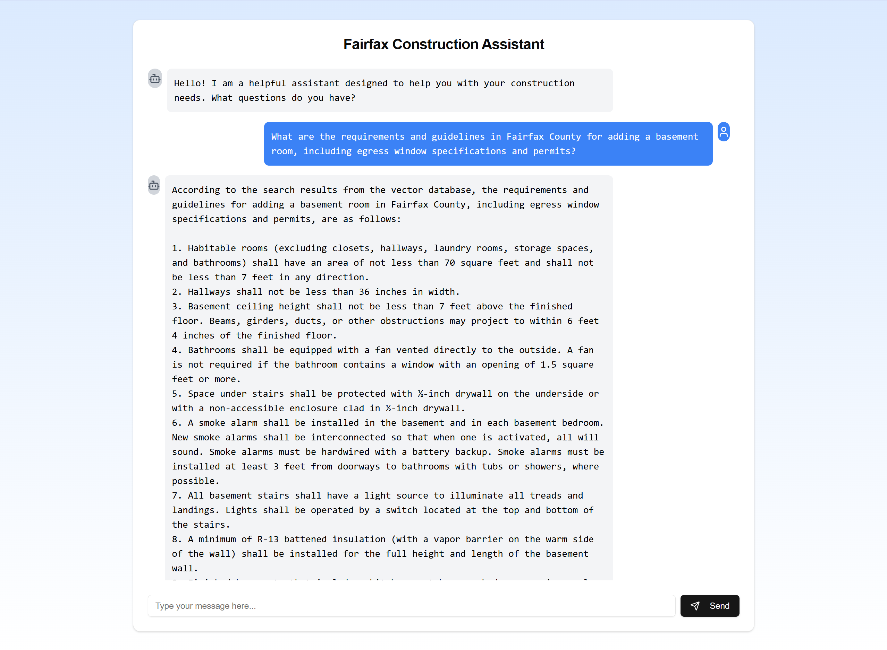

# Fairfax Construction Assistant

[link](http://stephen.ffx-consultant.com.s3-website-us-east-1.amazonaws.com/)

AI chatbot web application desinged to interact with construction contractors and provide helpful information regarding fairfax county code and manuls. 

## Features
- Interactive chat web interface
- Uses the LangGraph framework for natural language processing.
- Uses Rag and vectorstore to retrieve relevant information about fairfax county code and manuls
- Serverless backend API services


## Requirements

- Python 3.12
- Required Python libraries (see `requirements.txt` for details).
- Google Cloud Vertex API Key
- Pinecone API Key
- Groq API Key

## Prerequisites

#### Google Cloud Vertex API Key:
  1. Create a new project in the [Google Cloud Console](https://console.cloud.google.com/). 
  2. Setup credentials and download credentials into `./service` directory
   
#### Groq
  1. Create Groq API key. You can retrieve the key from the [GROQ Console](https://console.groq.com/keys).
#### Pinecone
  1. Create a Pinecone cluster. You can retrieve the API key from the [Pinecone Console](https://console.pinecone.io/).

#### Populate Vectorstore
  1. Crawl the fairfax county website using the script `python ./scripts/vectorstores/my_crawler.py`
  2. This will download all the fairfax county information in `service/consultation_company/vectorstores/web_scraping_data`
  3. Then run `python ./scripts/vectorstores/pinecone_loader.py` to load the documents into the pinecone vectorstore.


## Installation

1. Clone the repository:
    ```bash
    git clone https://github.com/wonhs91/fairfax-construction-assistant.git
    cd fairfax-construction-assistant
    ```
2. Create a virtual environment (optional but recommended):
    ```bash
    python -m venv .venv
    source venv/bin/activate   # On Windows: .venv\Scripts\activate
    ```

3. Client setup
   1. Install dependencies:
      * from the workspace directory
        ```bash
        cd client
        npm install
        ```

   2. Set up the .env file:
       - Create a .env file in the `./client` directory of the project:
       ```bash
       touch .env
       ```
       - Add the server's endpoint
        ```
        NEXT_PUBLIC_API_URL={server_endpoint}
        ```
        replace server_endpoint with actual server endpoint from the server setup
  
   3. Run the client application
        ```bash
        cd client
        npm run dev
        ```
4. Server setup
   1. Install dependencies:
        * from the workspace directory
        ```bash
        cd service
        pip install -r requirements.txt
        ```
   2. Set up the .env file:
       - Create a .env file in the `./service` directory of the project:
       ```bash
       cp .env_sample .env
       ```
       - Add the appropriate environment variables
   3. Run the server
        ```bash
        cd service
        python app.py
        ```


## Pushing dockerfile to ECR for Lambda deployment
1. Build docker image 
```bash
docker build -t ffx-consultant-lambda .
```

2. Test locally
```bash
docker run -p 9000:8080 ffx-consultant-lambda
```

3. test at `http://localhost:9000

4. Login to ECR
``` bash
aws ecr get-login-password --region <your-region> | docker login --username AWS --password-stdin <account-id>.dkr.ecr.<your-region>.amazonaws.com
```
5. Create a repository in ECR:
```bash
aws ecr create-repository --repository-name <repository-name>
```

6. Tag the image
```bash
docker tag ffx-consultant-lambda:latest <account-id>.dkr.ecr.<your-region>.amazonaws.com/<repository-name>:latest
```

7. Push the image
```bash
docker push <account-id>.dkr.ecr.<your-region>.amazonaws.com/<repository-name>:latest
```

## Sample Chat 

